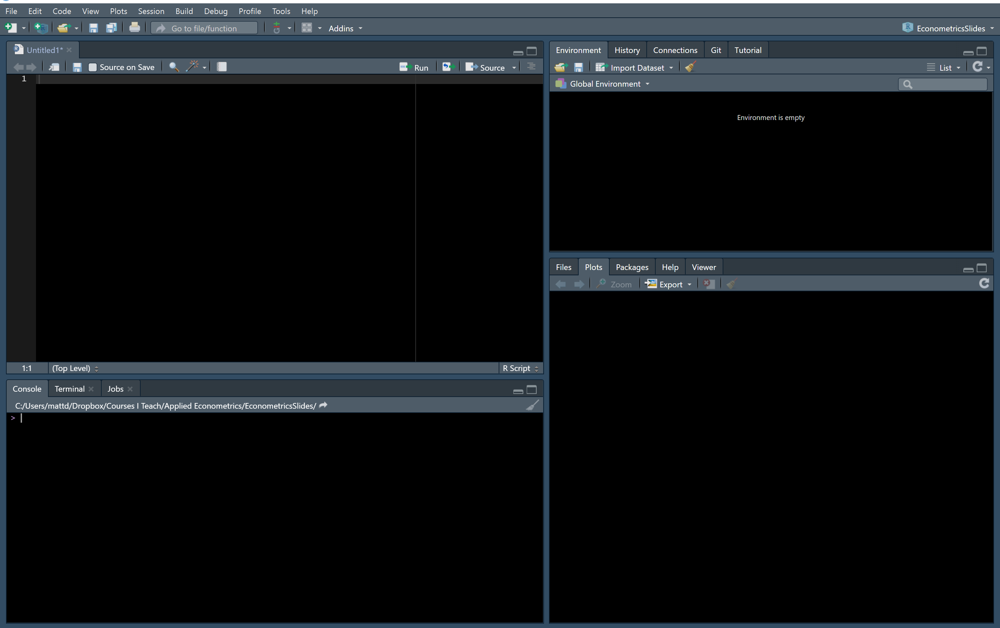

```{r setup, include=FALSE}
library(knitr)
library(tidyverse) # Keep things tidy
library(kableExtra) # Table Formattting
library(ggthemes)
library(ggpubr)
library(DiagrammeR) # Makes Flowcharts
library(WDI) # World Development Indicators
library(quantmod) # Gets FRED data
library(scales)
theme_set(theme_classic())
# knitr::opts_chunk$set(echo = FALSE, dev.args=list(bg="transparent")) 


###Color Themes
color1 <- "#FFFFFF" # white
color2 <- "#00205B" # med blue
color3 <- "#0A863D" # green
color4 <- "#99999A" # gray
color5 <- "#041C2C" # Navy


```
# Course Introduction

## What is Econometrics?

*Econometrics* is the branch of economics that applies statistics to economic theory. Thus, some math is unavoidable.  

However, the empnasis of this class is not *Econometrics*, it is *Applied Econometrics*.  Thus, our focus will be more on the application and interpretation of econometrics than the mathematical underpinning of the subject.

Less mathy does not mean easier.  While I will be doing my best to keep the calculus and linear algebra to a minimum, to actually *do* econometrics we are going to spend a large faction of this class learning some computer programming skills.  

## Course Gameplan

For the first month or so of this class, we will combine an extremely accelerated review of basic statistics (stuff you learned in BUS2160 and/or MAT2200) with an introduction to the statistical programming language called R.

Once we are through that, we will start learning econometrics, starting with basic OLS (which you may have seen in your intro stats class) and then progressing into more complicated variations on OLS that are useful in different contexts (Panel Regression, Instrumental variables, Probit/Logit/linear probability models, Tobit, Poisson, Negative Binomial, etc)

Time permitting, we may also look at time series methods and quasi-experimental methods.

## Course Gameplan

My hope is that this class will not be very lecture intensive and instead will be hands-on most of the time.

It is essential that you bring your computer - with R and RStudio installed - with you to class every day.  

Unless otherwise stated, I encourage groupwork and collaboration to work through the material.


# Intro to R

## What is R?

R is an open source programming/scripting language for statistics, data visualization, and analytics. 

Other competitors in this space include SAS, SPSS, Stata, and to lesser extents programs like Eviews, Matlab, Python ...

Some Pros of R: price (free!), powerful and extensible, *lingua franca* of statistics, ***probably*** here to stay.

Some Cons of R: steep learning curve, tough to keep track of extensions (packages), language can be inconsistent between packages.


## What is R?

R is a *command line interpreter* that can be used either *interactively* or with *scripts*

*Interactive* use: Use R langauge to type a command into the interpreter, and R executes that command.

Example: Let's ask R what 2+2 is.  If I type 2+2 into R


```{r}
2+2
```

At least R knows 2+2 doesn't equal 5!

## What is R?

For the most part, everything you do in R fits into one of three categories.  You are either

1. Creating *objects* (everything is an *object*).
2. Performing *functions* on objects to create new objects, or
3. Looking at objects.  

## Objects and Functions: An example

Using an R *script*:  A script is a set of commands that R runs sequentially to create output.

Here's a little script that does something you probably learned about in your intro stats class, a 2 sample t-test:

```{r eval=FALSE}
data(mtcars)
mean(mtcars$mpg[mtcars$cyl==4]) 
mean(mtcars$mpg[mtcars$cyl==6]) 
test1 <- t.test(mtcars$mpg[mtcars$cyl==6], mtcars$mpg[mtcars$cyl==4]) 
pander::pander(test1, split.cells = c(1,1,50,1,1,1))
```
Before we talk about what each line does, let's see what the results of running this script are!

## Objects and Functions: An example

```{r echo=FALSE}
data(mtcars) 
mean(mtcars$mpg[mtcars$cyl==4]) 
mean(mtcars$mpg[mtcars$cyl==6]) 
test1 <- t.test(mtcars$mpg[mtcars$cyl==6], mtcars$mpg[mtcars$cyl==4]) 
pander::pander(test1, split.cells = c(1,1,50,1,1,1))
```

## Objects and Functions: An example

Here's a better version of the script -- it is better because the commands have **comments** 

```{r eval=FALSE}
data(mtcars) # Load mtcars data into memory
mean(mtcars$mpg[mtcars$cyl==4]) # calculate the average MPG of 4 cylinder cars
mean(mtcars$mpg[mtcars$cyl==6]) # calculate the average MPG of 6 cylinder cars
test1 <- t.test(mtcars$mpg[mtcars$cyl==6], mtcars$mpg[mtcars$cyl==4]) # test the diff. in means 
pander::pander(test1, split.cells = c(1,1,50,1,1,1)) # Display the outcome of test1
```

The comments help you see what the purpose of every line is!

Let's look at this script, line-by-line, keeping the objects/functions framework in mind

## Objects and Functions: An example

```{r eval=FALSE}
data(mtcars) # Load mtcars data into memory
```


When R evaluates the first line, an object named mtcars is loaded into memory for us to play with.  mtcars is one of the many datasets preloaded into R.

mtcars includes data from Motor Trend magazine in 1974 about car fuel consumption.

mtcars is a type of object called a *Data Frame*, which is a whole lot like a spreadsheet where the rows are the observations and the columns are the variables.

## Objects and Functions: An example

```{r eval=FALSE}
mean(mtcars$mpg[mtcars$cyl==4]) # calculate the average MPG of 4 cylinder cars
```

Because mtcars is a Data Frame, we can refer to the object as mtcars. We can also refer to columns within the object by using the dollar sign ($) and subsets of the data using [braces].

So this line performs a function (mean) on the variable mpg in the data frame mtcars, but only for observations where the value of the variable cyl is equal to 4. 

## Objects and Functions: An example

```{r eval=FALSE}
mean(mtcars$mpg[mtcars$cyl==6]) # calculate the average MPG of 6 cylinder cars
```

Predictably, this line does the exact same thing but for 6 cylinder automobiles.  

We saw that the mean of 4 cylinder cars was `r mean(mtcars$mpg[mtcars$cyl==4])` and the mean of 6 cylinder cars was `r mean(mtcars$mpg[mtcars$cyl==6])`.

A natural question to ask is whether or not this difference is *statistically significant*, which suggests that the right approach is to calculate a two-sample t-test!

## Objects and Functions: An example

```{r eval=FALSE}
test1 <- t.test(mtcars$mpg[mtcars$cyl==6], mtcars$mpg[mtcars$cyl==4]) # test the diff. in means 
```

This line uses another function (t.test) to test whether or not the mpg of 6 cylinder cars is significantly different from the mpg of 4 cylinder cars.  

The little arrow (<-) assigns the results of the t-test to an object called test1

test1 will be an object type called a list.

Like with the Data Frames above, you can refer to items in this object with the $ as well.

For example, I could refer to test1\$conf.int if I wanted to know that the confidence interval of my t-test is [`r test1$conf.int`]. 

## Objects and Functions: An example

```{r eval=FALSE}
pander::pander(test1, split.cells = c(1,1,50,1,1,1)) # Display the outcome of test1
```

Finally, this line uses a function called pander.  pander is not part of r, rather, it is part of a package called pander.    

using pander::pander tells r to look in the package called pander for the function called pander. 

pander is going to take the object test1 and make a pretty table from it.  Later on, we will be making a lot of use of a similar package/function combo called *stargazer*.

## What is RStudio

Rather than using R in a standalone programming environment, it is usually easier to use R in an IDE (Integrated Development Environment).  

The primary IDE for R is called RStudio.

## Installing R and RStudio

You are going to need to download and install both [R](https://cran.r-project.org/) and 
[RStudio](https://www.rstudio.com). 

Both are free and can be used on a Windows, Mac, or Linux based computer.

Install R before installing RStudio!

## What is RStudio

The basic layout of RStudio has 4 panes.  

<div style="float: left; width: 70%;">
<center>

```{r out.width = "90%", echo=FALSE}

```
</center>
</div>

<div style="float: right; width: 30%;">

This looks a little different from what RStudio looks like "out of the box" but the differences are small.

</div>

## What is RStudio

<div style="float: left; width: 70%;">
<center>

```{r out.width = "90%", echo=FALSE}

```
</center>
</div>

<div style="float: right; width: 30%;">

The top left pane is the Editor Window.  This is mostly used for writing scripts or examining objects in your environment.  

Code in the editor window doesn't run get executed unless you tell it to run. 

</div>

## What is RStudio

<div style="float: left; width: 70%;">
<center>

```{r out.width = "90%", echo=FALSE}

```
</center>
</div>

<div style="float: right; width: 30%;">

The bottom left pane is the console Window.  You can use R interactively there. 

If you see a `>` you can run R code.  

if you see a `+` you have an unfinished R command and need to complete it.   

</div>

## What is RStudio

<div style="float: left; width: 70%;">
<center>

```{r out.width = "90%", echo=FALSE}

```
</center>
</div>

<div style="float: right; width: 30%;">

The top right pane is your environment Window.  You can see what objects and variables are stored in memory.

If you click on a data frame that is in your environment, you  will be able to view that data as a spreadsheet in your editor window.

</div>

## What is RStudio

<div style="float: left; width: 70%;">
<center>

```{r out.width = "90%", echo=FALSE}

```
</center>
</div>

<div style="float: right; width: 30%;">

The bottom right pane has a bunch of different stuff.  The most common and useful views down there are:

- Help
- Package info
- Plots/Graphs
- Directory structure


</div>

## Configuring RStudio

You might want to play around with some of the stuff in Tools -> Global Options

You can change the way RStudio looks by editing the appearance.  If you want a dark theme, make sure you change the theme to "Modern" or "sky".  

I would suggest choosing a theme that has a lot of contrasting colors to make reading your code easier.  One of the primary benefits of using RStudio, especially when you are just learning, is the automatic color coding done by themes.

I typically use Tomorrow Night Bright, but also like Cobalt, Merbivore Soft, and Vibrant Ink.

## Configuring RStudio

Another useful configuration to know about is under "Packages" -- a CRAN mirror is where R gets packages from. 

CRAN mirrors are typically updated daily.

RStudio defaults to using the CRAN mirror called "Global (CDN) - RStudio" 

This is usually fine, and is run on the Amazon Cloud.  If you have issues, though, you might choose a mirror that is close to you geographically to speed up your downloads.

## Getting Help in R

Under Help -> Cheatsheets, RStudio has a bunch of coding cheatsheets that are super useful for when you are trying to figure out how to do things.  

You can find a more comprehensive list of cheatsheets at [https://rstudio.com/resources/cheatsheets/](https://rstudio.com/resources/cheatsheets/)

Cheatsheets may be worth printing out and keeping handy while working.  

## Getting Help in R

More generally, if you need help in R there are TONS of online sources.  Beyond just googling things (which works most of the time), you can try:

[rseek.org](http://rseek.org) is a search engine for R related issues.

Online message boards (Reddit has /rstats, Stack Overflow has tons of R Q/A, community.rstudio.com, etc...)

R ebooks are often free!  Many of them are on RPubs.org

YouTube has tons of videos on R.

Twitter has a big R community -- look for hashtags like #rstats, #tidytuesday, #rladies, #tidyverse, #rtweet
